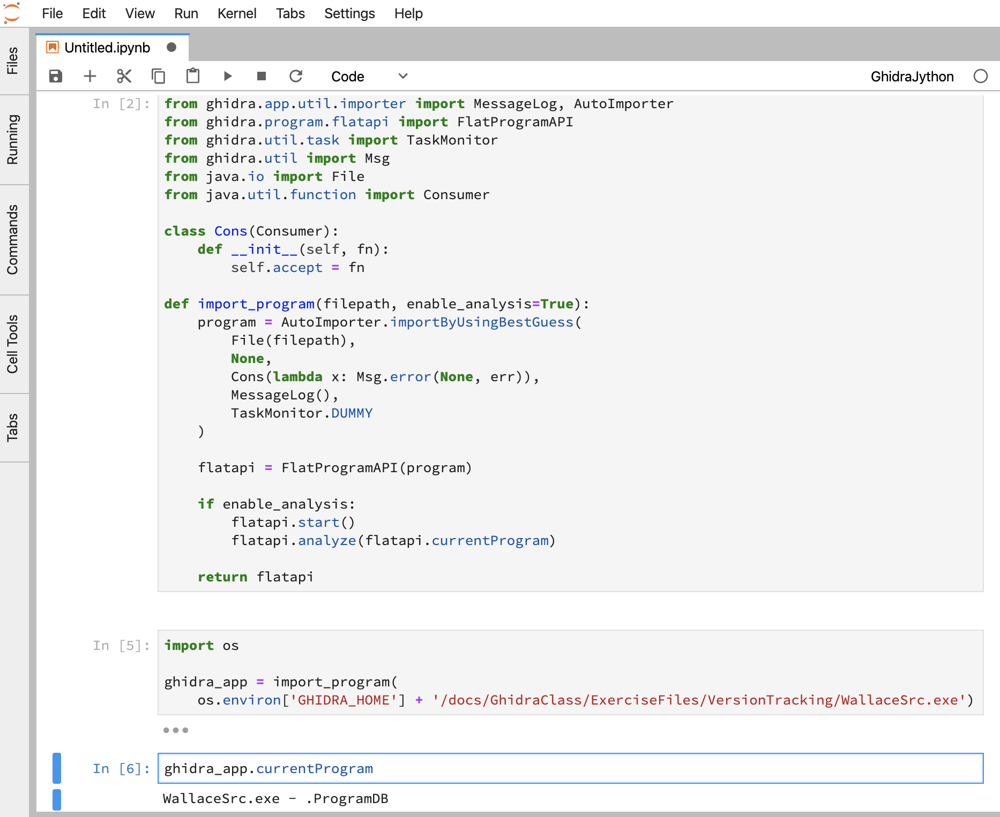

[](https://github.com/AllsafeCyberSecurity/ghidra-jython-kernel/actions)

# Ghidra Jython Kernel

Jupyter kernel for Ghidra's Jython.



## Install
```bash
$ pip install ghidra-jython-kernel

# make sure GHIDRA_INSTALL_DIR is defined
# don't forget to add this line in your shell config (i.e. bashrc, zshrc)
$ export GHIDRA_INSTALL_DIR=/path/to/your/ghidra_installation_folder
```

## Usage

Run your Jupyter(`jupyter notebook`), and select `GhidraJython` named kernel.


Note that, unlike GhidraPython plugin's interpreter, in the context the current running Jython interpreter, you have to import program by yourself. This means, pre-initialized variables in GhidraScript, like `currentProgram` or `state`, aren't available unless you import manually. You can import programs as following.

```python
from ghidra.app.util.importer import MessageLog, AutoImporter
from ghidra.program.flatapi import FlatProgramAPI
from ghidra.util.task import TaskMonitor
from ghidra.util import Msg
from java.io import File
from java.util.function import Consumer

class Cons(Consumer):
    def __init__(self, fn):
        self.accept = fn

def import_program(filepath, enable_analysis=True):
    program = AutoImporter.importByUsingBestGuess(
        File(filepath),
        None,
        Cons(lambda x: Msg.error(None, err)), 
        MessageLog(),
        TaskMonitor.DUMMY
    )
    
    flatapi = FlatProgramAPI(program)
    
    if enable_analysis:
        flatapi.start()
        flatapi.analyze(flatapi.currentProgram)
        
    return flatapi

ghidra_app = import_program('/path/to/your/program')

# now you can access to `currentProgram`
ghidra_app.currentProgram
```


